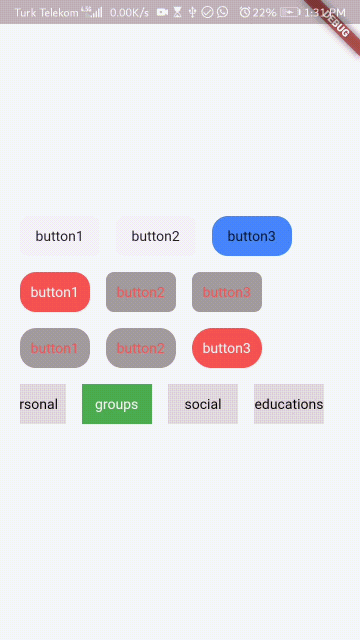

# easy_animated_tabbar
[](https://pub.dev/packages/easy_animated_tabbar)

[](https://pub.dev/packages/effective_dart)
Maybe you want use a tabbar without any additional page so this package help you to make your tabbar.
In additional some tiems you want create a selectable button list.



## Getting Started
## You can use it simply way as : 
```
EasyAnimatedTab(
            buttonTitles: ['button1','button2'],
            onSelected: (index) {},
          ),
```
## Or add adittional options for custome it:
```
EasyAnimatedTab(
            buttonTitles: buttons,
            onSelected: (index) {},
            animationDuration: 500,
            minWidthOfItem: 70,
            minHeightOfItem: 40,
            deActiveItemColor: Colors.grey,
            activeItemColor: Colors.redAccent,
            activeTextStyle: TextStyle(color: Colors.white, fontSize: 14),
            deActiveTextStyle: TextStyle(color: Colors.redAccent, fontSize: 14),
          ),
```
## This package has below options:
* List<String> buttonTitles : the titles list that show
* void Function(int) onSelected : that return selected index
* int selectedIndex : that is starter selected item index the defualt value is 0
* int animationDuration : the duration of animation for changing between current selected item and last one
* double minWidthOfItem : this is min width of items, the defualt value is 80
* double minHeightOfItem : this is min height of items, the defualt value is 40
* Color deActiveItemColor : color of deactivated items
* Color activeItemColor : color of activeated items
* TextStyle activeTextStyle : style of activated item's text
* TextStyle deActiveTextStyle: style of de activated item's text
* double activeBorderRadius : border radius of active item
* double deActiveBorderRadius : border radius of de active item
## You can add your issue to this repository to help growing this package  
This project is a starting point for a Dart
[package](https://flutter.dev/developing-packages/),
a library module containing code that can be shared easily across
multiple Flutter or Dart projects.

For help getting started with Flutter, view our 
[online documentation](https://flutter.dev/docs), which offers tutorials, 
samples, guidance on mobile development, and a full API reference.
